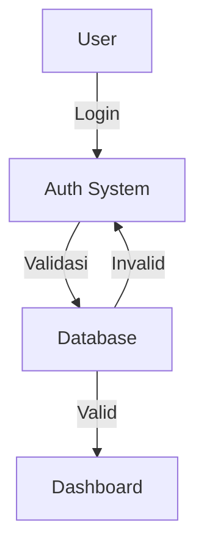
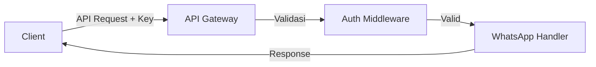
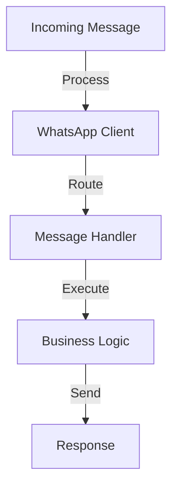

# WhatsApp Bot API

Aplikasi WhatsApp Bot API adalah sistem yang memungkinkan integrasi WhatsApp dengan layanan eksternal melalui REST API. Aplikasi ini mendukung autentikasi, manajemen sesi WhatsApp, dan berbagai fitur WhatsApp automation.

## Fitur Utama

- 🔐 Sistem autentikasi berbasis database
- 📱 Manajemen multi-sesi WhatsApp
- 🔄 REST API untuk integrasi
- 📊 Dashboard monitoring
- 🛡️ Keamanan API dengan API Key
- 📝 Dokumentasi API terintegrasi

## Persyaratan Sistem

### Software yang Dibutuhkan
- Node.js (v14 atau lebih baru)
- MySQL/MariaDB
- XAMPP/aapanel (untuk pengembangan lokal)
- Web Browser modern
- Git (opsional)

### Spesifikasi Minimum Server
- RAM: 2GB
- CPU: 2 Core
- Storage: 10GB
- OS: Linux/Windows

## Alur Sistem

### 1. Sistem Autentikasi


### 2. Alur API


### 3. Alur WhatsApp


## Instalasi

### A. Pengembangan Lokal (XAMPP)

1. **Clone/Download Repository**
   ```bash
   git clone [repository-url]
   cd wabot-api
   ```

2. **Install Dependencies**
   ```bash
   npm install
   ```

3. **Setup Database**
   - Buka phpMyAdmin (http://localhost/phpmyadmin)
   - Buat database baru: wabot_db
   - Import file: database/schema.sql

4. **Konfigurasi Environment**
   - Copy `.env.example` ke `.env`
   - Sesuaikan konfigurasi:
   ```env
   PORT=1992
   SESSION_SECRET=whatsapp_api_secret_key_here
   API_KEY=your_api_key_here
   SENDER_ID=your_sender_id

   # Database
   DB_HOST=localhost
   DB_USER=root
   DB_PASSWORD=
   DB_NAME=wabot_db
   ```

5. **Jalankan Aplikasi**
   ```bash
   npm start
   ```

### B. Instalasi di aaPanel

#### 1. Persiapan Server
```bash
# Install Node.js melalui aaPanel App Store atau command line
wget -qO- https://raw.githubusercontent.com/nvm-sh/nvm/v0.39.0/install.sh | bash
source ~/.bashrc
nvm install 14  # atau versi yang lebih baru

# Install PM2
npm install -g pm2
```

#### 2. Clone Repository
```bash
# Masuk ke direktori web
cd /www/wwwroot/nama-domain-anda

# Clone repository
git clone https://github.com/okebill/whatsapp-okebill.git

# Masuk ke direktori project
cd whatsapp-okebill
```

#### 3. Setup Database
- Buka phpMyAdmin di aaPanel
- Buat database baru: `wabot_db`
- Import file `database/schema.sql`

#### 4. Konfigurasi Environment
Buat file `.env`:
```env
# Server Configuration
PORT=1992
SESSION_SECRET=whatsapp_api_secret_key_here

# API Configuration
API_KEY=your_api_key_here
SENDER_ID=your_sender_id

# Database Configuration
DB_HOST=localhost
DB_USER=username_database_anda
DB_PASSWORD=password_database_anda
DB_NAME=wabot_db
```

#### 5. Install Dependencies dan Jalankan
```bash
# Install dependencies
npm install

# Jalankan dengan PM2
pm2 start ecosystem.config.js
pm2 save

# Auto-start saat server reboot
pm2 startup
```

#### 6. Setup Nginx Reverse Proxy
Di aaPanel, tambahkan konfigurasi proxy berikut ke website Anda:
```nginx
location /wabot/ {
    proxy_pass http://127.0.0.1:1992/;
    proxy_http_version 1.1;
    proxy_set_header Upgrade $http_upgrade;
    proxy_set_header Connection 'upgrade';
    proxy_set_header Host $host;
    proxy_cache_bypass $http_upgrade;
    proxy_set_header X-Real-IP $remote_addr;
    proxy_set_header X-Forwarded-For $proxy_add_x_forwarded_for;
}
```

#### 7. Atur Permissions
```bash
# Atur kepemilikan file
chown -R www:www /www/wwwroot/nama-domain-anda/whatsapp-okebill

# Atur permissions
chmod -R 755 /www/wwwroot/nama-domain-anda/whatsapp-okebill
chmod -R 777 /www/wwwroot/nama-domain-anda/whatsapp-okebill/sessions
```

#### 8. Verifikasi Instalasi
```bash
# Cek status aplikasi
pm2 status

# Lihat log
pm2 logs whatsapp-okebill
```

### Troubleshooting

#### 1. Masalah Database
- Periksa kredensial di file `.env`
- Pastikan user database memiliki akses yang benar
- Cek log error di PM2: `pm2 logs`

#### 2. WhatsApp Tidak Terkoneksi
- Periksa folder `sessions`
- Pastikan permissions folder sudah benar
- Scan ulang QR code
- Cek log untuk error detail

#### 3. Web Tidak Bisa Diakses
- Verifikasi konfigurasi nginx
- Pastikan port 1992 tidak diblokir firewall
- Cek log nginx: `/www/wwwlogs/nama-domain-anda.error.log`

#### 4. Permission Issues
- Pastikan folder `sessions` writeable
- Periksa ownership file dan folder
- Sesuaikan permissions jika diperlukan

### Keamanan

#### 1. Firewall
- Buka port yang diperlukan saja
- Gunakan SSL/HTTPS
- Batasi akses ke endpoint admin

#### 2. Database
- Gunakan password yang kuat
- Batasi akses database
- Backup secara berkala

#### 3. API
- Ganti API_KEY default
- Implementasi rate limiting
- Monitor log akses

### Maintenance

#### 1. Update Aplikasi
```bash
cd /www/wwwroot/nama-domain-anda/whatsapp-okebill
git pull
npm install
pm2 restart all
```

#### 2. Backup
- Backup database secara berkala
- Backup folder sessions
- Simpan file .env

#### 3. Monitoring
- Cek log aplikasi: `pm2 logs`
- Monitor penggunaan resources
- Setup alert untuk downtime

## Penggunaan API

### Endpoint Utama

1. **Autentikasi**
   - POST `/auth/login` - Login user
   - GET `/auth/logout` - Logout user

2. **WhatsApp API**
   - POST `/api/send-message` - Kirim pesan
   - POST `/api/send-media` - Kirim media
   - GET `/api/status` - Cek status koneksi

### Contoh Request

```javascript
// Kirim pesan
POST /api/send-message
Headers: {
  "api-key": "your_api_key"
}
Body: {
  "number": "628123456789",
  "message": "Hello World"
}
```

## Keamanan

- Menggunakan bcrypt untuk hashing password
- API Key untuk akses endpoint
- Rate limiting untuk mencegah abuse
- Session management untuk autentikasi
- Validasi input untuk mencegah injeksi

## Troubleshooting

### Masalah Umum

1. **Koneksi Database**
   - Periksa kredensial di `.env`
   - Pastikan service MySQL berjalan
   - Cek firewall/port

2. **WhatsApp Tidak Terkoneksi**
   - Scan ulang QR Code
   - Periksa sesi di folder `sessions`
   - Restart aplikasi

3. **API Error**
   - Validasi API Key
   - Periksa format request
   - Cek log aplikasi

## Dukungan

Untuk bantuan dan dukungan:
- Buka issue di repository
- Kontak tim developer
- Cek dokumentasi API

## Lisensi

Project ini dilisensikan di bawah Lisensi MIT - lihat file [LICENSE](LICENSE) untuk detail.

### Rangkuman Lisensi MIT

Lisensi MIT memberikan hak berikut:
- ✅ Penggunaan komersial
- ✅ Modifikasi
- ✅ Distribusi
- ✅ Penggunaan pribadi

Dengan ketentuan:
- ⚠️ Menyertakan salinan lisensi dan copyright notice
- ⚠️ Tidak ada jaminan/garansi
- ⚠️ Penulis tidak bertanggung jawab atas kerusakan/kerugian

### Cara Menggunakan Kode Ini

1. Anda bebas menggunakan kode ini untuk:
   - Project pribadi
   - Project komersial
   - Memodifikasi sesuai kebutuhan
   - Mendistribusikan ulang

2. Yang perlu Anda lakukan:
   - Menyertakan file LICENSE
   - Mencantumkan copyright notice
   - Mencantumkan pernyataan lisensi MIT

3. Yang TIDAK perlu Anda lakukan:
   - Membayar royalti
   - Membuka source code project Anda
   - Menggunakan lisensi yang sama untuk project turunan 
