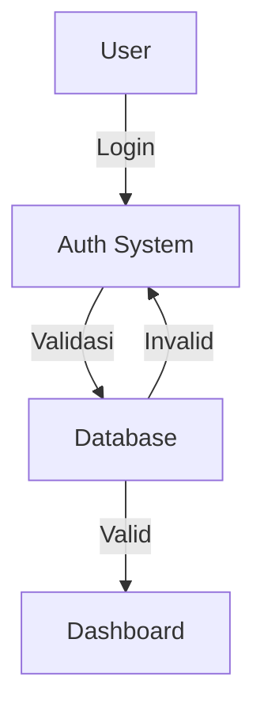
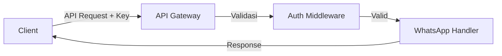
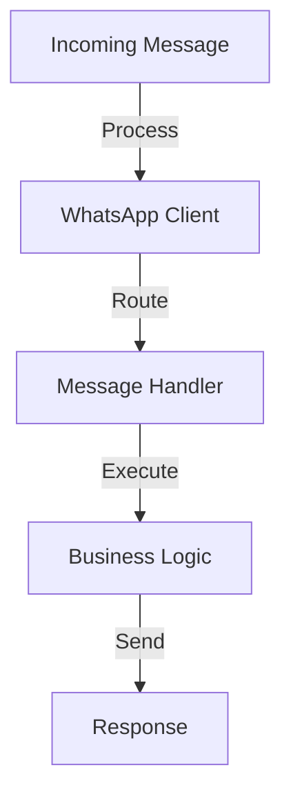

# WhatsApp Bot API

Aplikasi WhatsApp Bot API adalah sistem yang memungkinkan integrasi WhatsApp dengan layanan eksternal melalui REST API. Aplikasi ini mendukung autentikasi, manajemen sesi WhatsApp, dan berbagai fitur WhatsApp automation.

## Fitur Utama

- 🔐 Sistem autentikasi berbasis database
- 📱 Manajemen multi-sesi WhatsApp
- 🔄 REST API untuk integrasi
- 📊 Dashboard monitoring
- 🛡️ Keamanan API dengan API Key
- 📝 Dokumentasi API terintegrasi

## Persyaratan Sistem

### Software yang Dibutuhkan
- Node.js (v14 atau lebih baru)
- MySQL/MariaDB
- XAMPP/aapanel (untuk pengembangan lokal)
- Web Browser modern
- Git (opsional)

### Spesifikasi Minimum Server
- RAM: 2GB
- CPU: 2 Core
- Storage: 10GB
- OS: Linux/Windows

## Alur Sistem

### 1. Sistem Autentikasi


### 2. Alur API


### 3. Alur WhatsApp


## Instalasi

### A. Pengembangan Lokal (XAMPP)

1. **Clone/Download Repository**
   ```bash
   git clone [repository-url]
   cd wabot-api
   ```

2. **Install Dependencies**
   ```bash
   npm install
   ```

3. **Setup Database**
   - Buka phpMyAdmin (http://localhost/phpmyadmin)
   - Buat database baru: wabot_db
   - Import file: database/schema.sql

4. **Konfigurasi Environment**
   - Copy `.env.example` ke `.env`
   - Sesuaikan konfigurasi:
   ```env
   PORT=1992
   SESSION_SECRET=whatsapp_api_secret_key_here
   API_KEY=your_api_key_here
   SENDER_ID=your_sender_id

   # Database
   DB_HOST=localhost
   DB_USER=root
   DB_PASSWORD=
   DB_NAME=wabot_db
   ```

5. **Jalankan Aplikasi**
   ```bash
   npm start
   ```

### B. Deployment di aapanel

1. **Persiapan Server**
   - Install Node.js dari App Store aapanel
   - Install PM2: `npm install -g pm2`
   - Pastikan MySQL sudah terinstall

2. **Upload Project**
   - Upload semua file ke direktori website
   - Biasanya di: `/www/wwwroot/nama-domain-anda`

3. **Setup Database**
   - Buat database dan user di aapanel
   - Import schema database

4. **Konfigurasi Environment**
   - Sesuaikan file `.env` dengan kredensial server

5. **Install Dependencies & Jalankan**
   ```bash
   cd /www/wwwroot/nama-domain-anda
   npm install
   pm2 start ecosystem.config.js
   pm2 save
   ```

6. **Setup Reverse Proxy**
   - Tambahkan konfigurasi nginx untuk reverse proxy
   - Gunakan contoh di file: nginx.conf.example

## Penggunaan API

### Endpoint Utama

1. **Autentikasi**
   - POST `/auth/login` - Login user
   - GET `/auth/logout` - Logout user

2. **WhatsApp API**
   - POST `/api/send-message` - Kirim pesan
   - POST `/api/send-media` - Kirim media
   - GET `/api/status` - Cek status koneksi

### Contoh Request

```javascript
// Kirim pesan
POST /api/send-message
Headers: {
  "api-key": "your_api_key"
}
Body: {
  "number": "628123456789",
  "message": "Hello World"
}
```

## Keamanan

- Menggunakan bcrypt untuk hashing password
- API Key untuk akses endpoint
- Rate limiting untuk mencegah abuse
- Session management untuk autentikasi
- Validasi input untuk mencegah injeksi

## Troubleshooting

### Masalah Umum

1. **Koneksi Database**
   - Periksa kredensial di `.env`
   - Pastikan service MySQL berjalan
   - Cek firewall/port

2. **WhatsApp Tidak Terkoneksi**
   - Scan ulang QR Code
   - Periksa sesi di folder `sessions`
   - Restart aplikasi

3. **API Error**
   - Validasi API Key
   - Periksa format request
   - Cek log aplikasi

## Dukungan

Untuk bantuan dan dukungan:
- Buka issue di repository
- Kontak tim developer
- Cek dokumentasi API

## Lisensi

Project ini dilisensikan di bawah Lisensi MIT - lihat file [LICENSE](LICENSE) untuk detail.

### Rangkuman Lisensi MIT

Lisensi MIT memberikan hak berikut:
- ✅ Penggunaan komersial
- ✅ Modifikasi
- ✅ Distribusi
- ✅ Penggunaan pribadi

Dengan ketentuan:
- ⚠️ Menyertakan salinan lisensi dan copyright notice
- ⚠️ Tidak ada jaminan/garansi
- ⚠️ Penulis tidak bertanggung jawab atas kerusakan/kerugian

### Cara Menggunakan Kode Ini

1. Anda bebas menggunakan kode ini untuk:
   - Project pribadi
   - Project komersial
   - Memodifikasi sesuai kebutuhan
   - Mendistribusikan ulang

2. Yang perlu Anda lakukan:
   - Menyertakan file LICENSE
   - Mencantumkan copyright notice
   - Mencantumkan pernyataan lisensi MIT

3. Yang TIDAK perlu Anda lakukan:
   - Membayar royalti
   - Membuka source code project Anda
   - Menggunakan lisensi yang sama untuk project turunan 